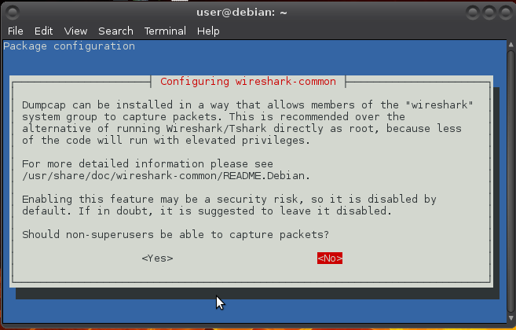
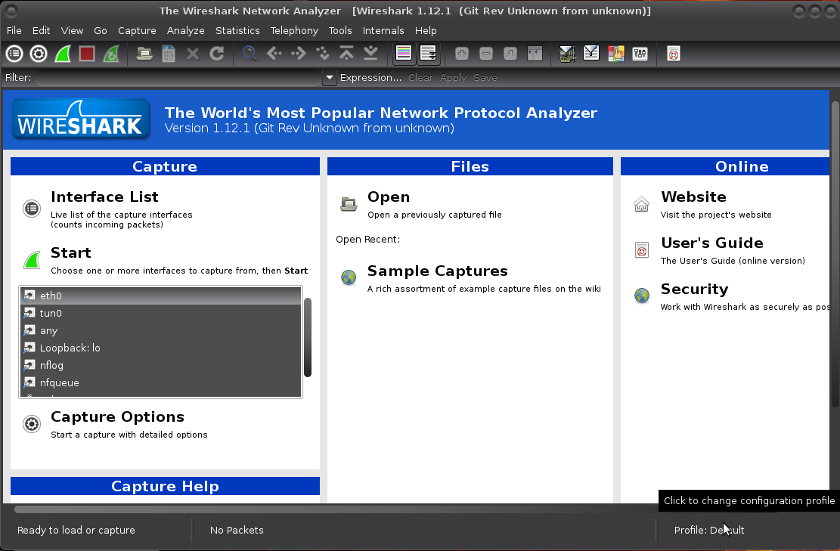
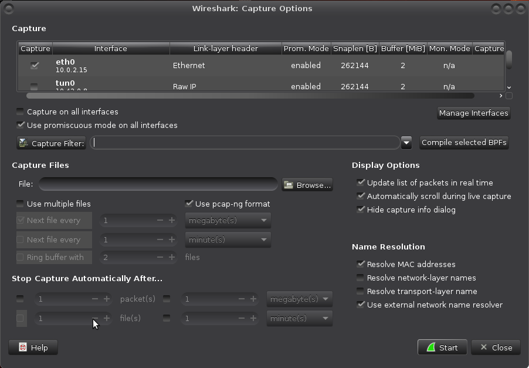
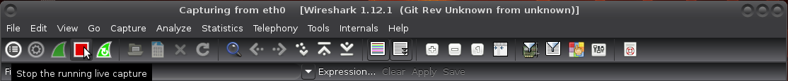
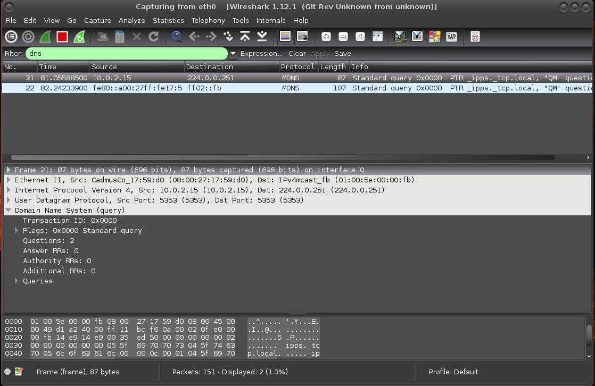
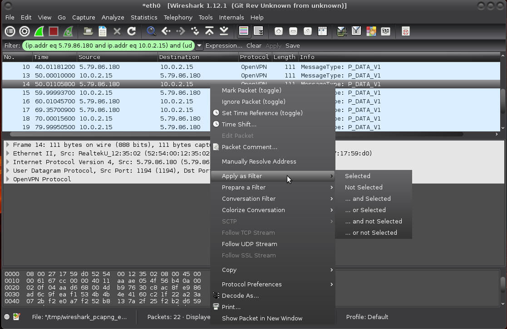

# Wireshark

[Wireshark](https://www.wireshark.org/) (GNU GPL v2) is a network packet analyzer, developed and maintained by a global team of protocol experts. It used to be known as Ethereal, and was renamed to Wireshark in May 2006. 

## Installation 
    
    $ sudo apt-get install wireshark

Choose YES if you want to capture packets as user: 

You will also need to allow non-root users to capture packets. For that, follow the procedure described in `/usr/share/doc/wireshark-common/README.Debian` (if you're on debian, that is):

    $ sudo adduser user wireshark

##  Capturing packets
Launch it and click the name of an interface under //Interface List// to start capturing packets on that interface: 

Configure advanced features by clicking `Capture Options`: 

As soon as you click //Start//, you’ll see the packets start to appear in real time. Wireshark captures each packet sent to or from your system. If you’re capturing on a wireless interface and have promiscuous mode enabled in your capture options, you’ll also see other the other packets on the network.

Click the stop capture button near the top left corner of the window when you want to stop capturing traffic. 

## Filtering packets 

If you’re trying to inspect something specific, such as the traffic a program sends, it helps to close down all other applications using the network so you can narrow down the traffic. Still, you’ll likely have a large amount of packets to sift through. That’s where filtering comes in.

The most basic way to apply a filter is by typing it into the filter box at the top of the window and clicking //Apply//. For example, type `dns` and you’ll see only DNS packets. 

Another interesting thing you can do is right-click a packet and select Follow TCP, UDP or SSL Stream.

## Inspecting packets
Click a packet to select it and you can dig down to view its details. You can also create filters by using the //Apply as Filter// sub menu to create a filter based on it (those ands and ors are propositional logic): 

