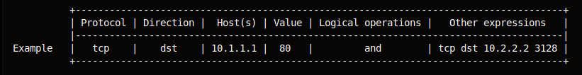

# tcpdump

[Tcpdump](https://www.tcpdump.org/) is a command-line packet analyser; and libpcap is a portable C/C++ library for network traffic capture. It is a common packet analyzer that runs under the command line. It allows the user to display TCP/IP and other packets being transmitted or received over a network to which the computer is attached. Distributed under the BSD license, `tcpdump` is free software. 

Tcpdump works on most Unix-like operating systems: Linux, Solaris, BSD, macOS, HP-UX, Android and AIX among others. In those systems, `tcpdump` uses the `libpcap` library to capture packets. The version of `tcpdump` for Windows is called WinDump; it uses WinPcap, the Windows version of `libpcap`.

## Syntax

Protocol: Values: `ether`, `fddi`, `ip`, `arp`, `rarp`, `decnet`, `lat`, `sca`, `moprc`, `mopdl`, `tcp` and `udp`. If no protocol is specified, all the protocols are used.

Direction: Values: `src`, `dst`, `src and dst`, `src or dst` If no source or destination is specified, the `src` or `dst` keywords are applied. For example, host `10.2.2.2` is equivalent to `src or dst host 10.2.2.2`.

Host(s): Values: net, port, host, portrange. If no host(s) is specified, the host keyword is used. For example, src 10.1.1.1 is equivalent to src host 10.1.1.1.

Logical operations: Values: `not`, `and`, `or`. Negation (`not`) has highest precedence. Alternation (`or`) and concatenation (`and`) have equal precedence and associate left to right. For example, `not tcp port 3128 and tcp port 23` is equivalent to `(not tcp port 3128) and tcp port 23` while `not tcp port 3128 and tcp port 23` is NOT equivalent to `not (tcp port 3128 and tcp port 23)`.

## Usage examples 

### Network mapping

Reuseful different combinations of options to tcpdump:

* Basic communication: `-nS`
* Verbose communication: `-nnvvS` (verbosity and no name help)
* Deeper look: `-nnvvXS` (`-X` for payload but doesn’t grab any more of the packet)
* Rock bottom: `-nnvvXSs` (`-s` increases the snaplength, grabbing the whole packet)

Expressions allow for trimming out various types of traffic and finding exactly what you’re looking for. Mastering the expressions and learning to combine them creatively is what makes one truly powerful with `tcpdump`. There are three main types of expression: type, dir, and proto.

Type options are `host`, `net`, and `port`. Direction is indicated by `dir`, and there you can have `src`, `dst`, `src` or `dst`, and `src` and `dst`.

Look for traffic based on IP address (also works with hostname if you’re not using -n):

    # tcpdump host XXX.XXX.XXX.XXX

Find traffic from only source or destination (eliminate one side of a host conversation)

    # tcpdump src XXX.XXX.XXX.XXX

or

    # tcpdump dst XXX.XXX.XXX.XXX

Capture an entire network using CIDR notation:

    # tcpdump net XXX.XXX.XXX.XXX/24

proto works for tcp, udp, and icmp:

    # tcpdump [proto]

For example:

    # tcpdump icmp

See traffic to or from a port:

    # tcpdump port [portnumber]

Filter based on the source or destination port:

    # tcpdump src port [portnumber]

or

    # tcpdump dst port [portnumber]

Combine in something like:

    # tcpdump src port 1025 and tcp

or

    # tcpdump udp and src port 53

You can also filter by a range of ports:

    # tcpdump portrange 21-23

And ask to be only shown packets that are above or below a certain size (in bytes):

    # tcpdump less 32

or

    # tcpdump greater 128

And instead of using words, you can use the symbols for less than, greater than, and less than or equal/greater than or equal signs:

    # tcpdump <= 32

or

    # tcpdump > 128

### Sniffing passwords

Network interfaces available for the capture:

    # tcpdump -D
    1.eth0
    2.any (Pseudo-device that captures on all interfaces)
    3.lo

Sniffing passwords using egrep:

    # tcpdump port http or port ftp or port smtp or port imap or port pop3 -l -A | egrep -i 'pass=|pwd=|log=|login=|user=|username=|pw=
|passw=|passwd=|password=|pass:|user:|username:|password:|login:|pass|user' --color=auto --line-buffered -B20

To send the capture output in a file instead of directly on the screen:

    # tcpdump -w capture.log

To read a capture file:

    # tcpdump -r capture.log

The captured data isn't stored in plain text and cannot be read with a text editor, you have to use a tool like [wireshark](Wireshark.md) which provides a graphical interface. 

